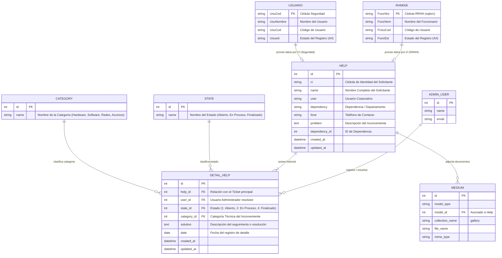

# ERD — Modelo Entidad-Relación de Asistencia Técnica

## Propósito y Alcance

Este modelo lógico define la estructura de datos del **Sistema de Asistencia Técnica (`asistencia`)**, soportando la gestión de tickets de ayuda, historial de cambios de estado, categorías técnicas, adjuntos multimedia y la integración con fuentes externas de personal (**Recursos Humanos / RHM006** y **Seguridad / Usuario**).

## Diagrama ERD

## Reglas de Integridad y Negocio

1. **Historial Inmutable:** Todo ticket (`HELP`) cuenta con al menos un registro inicial en `DETAIL_HELP` con `state_id = 1` (Abierto).
2. **Fuentes Exógenas:** Las consultas por cédula acceden secuencialmente a la vista/tabla `RHM006` (Recursos Humanos) y en caso de no hallar coincidencia, a la tabla `USUARIO` (Seguridad).
3. **Múltiples Adjuntos:** Las evidencias y documentos técnicos se almacenan utilizando Spatie MediaLibrary en la tabla `MEDIUM`.
