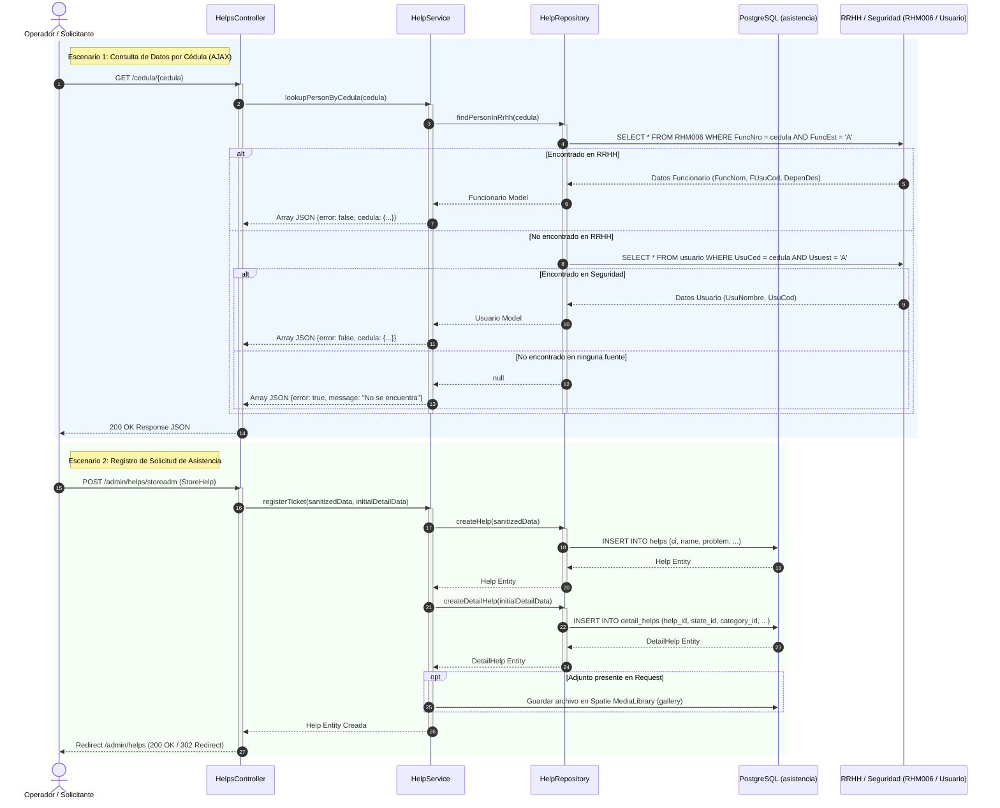

# Diagrama de Secuencia — Flujos Principales de Asistencia Técnica

Este diagrama documenta la secuencia de interacción bajo la arquitectura de **3 Capas (`Controller -> Service -> Repository`)** implementada en el sistema.

## Componentes y Capas

1. **`HelpsController`:** Recibe HTTP requests, desencadena la validación de contratos mediante FormRequests (`StoreHelp`, `UpdateHelp`) y delega la lógica de negocio al servicio.
2. **`HelpService`:** Ejecuta las reglas de negocio (orquestación del ticket, creación automática de detalle inicial y búsqueda jerárquica de personal por Cédula).
3. **`HelpRepository`:** Encapsula el acceso directo a la base de datos PostgreSQL y las tablas de legado/soporte.
